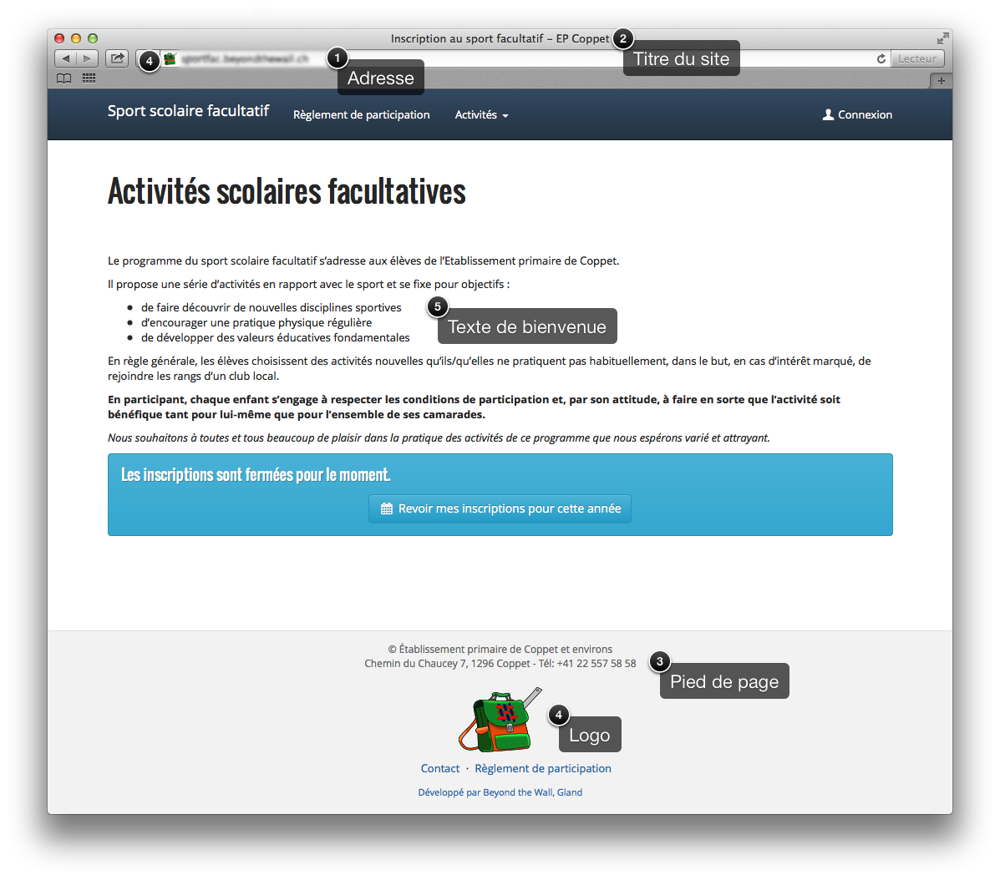

#############
Configuration
#############

.. |check| raw:: html

    <input checked=""  type="checkbox">

.. |check_| raw:: html

    <input checked=""  disabled="" type="checkbox">

.. |uncheck| raw:: html

    <input type="checkbox">

.. |uncheck_| raw:: html

    <input disabled="" type="checkbox">

Adresse
=======
L'adresse du site est celle qui sera communiquée aux utilisateurs, sous la forme, par exemple, https://nyon.kepchup.ch.
Les adresses du type votrenom.ch sont à réserver auprès d'un registrar, par exemple `Gandi <http://gandi.net>`_.

Les adresses du type votrenom.kepchup.ch sont gratuites.

* domaine personnel: _____________________ 

ou

* sous domaine de kepchup: _________________.kepchup.ch

Options
=======
Certaines fonctionnalités peuvent être activées ou désactivées:

Absences
--------
|uncheck| Activer la gestion des absences

Si oui
~~~~~~
Heure d'envoi des rappels: _______:________

Facturation
-----------

|uncheck| Activer la gestion de la facturation (inutile si toutes les activités sont gratuites)

Paiement en ligne
~~~~~~~~~~~~~~~~~~
  
|uncheck| Activer le paiement en ligne via datatrans):

-  Clé d'API Datatrans: ______________________
-  Méthodes de paiement acceptées

  -  |uncheck| Mastercard / Visa / AmEx
  -  |uncheck| Maestro 
  -  |uncheck| Twint 
  -  |uncheck| Paypal
  -  |uncheck| Postfinance card 
  -  |uncheck| Apple pay
  -  |uncheck| Google pay 
  -  |uncheck| Cryptomonnaies 

Paiement par facture
~~~~~~~~~~~~~~~~~~~~

|uncheck| Activer le paiement par facture + IBAN:
Les utilisateurs paient par virement bancaire, ou en apportant l'argent directement. Il n'y a pas de système de recoupement automatique avec un compte en banque.

* Texte d'explication.

:Exemple:
  | Nous vous remercions de verser cette somme d’ici au 31.10.2019 en privilégiant le virement bancaire sur le compte :
  | IBAN: CH77 0076 7000 C507 0682 4
  | Adresse: AIC, 1201 Genève

* Délai de paiement en jours depuis la fin des inscriptions (ex: 30): ___________

Personnalisation du site
========================
* Titre du site: Il apparait dans la barre de titre du navigateur sur chaque page.

:Exemple:
  | Inscription au sport facultatif - EP Coppet
    

* Pied de page: il est identique sur toutes les pages. On y place généralement le nom et l'adresse de contact, ainsi qu'un logo.

:Exemple:
  | © Établissement primaire de Coppet et environs
  | Chemin du Chaucey 7, 1296 Coppet - Tél: +41 22 557 58 58
  | 
  | [logo]

* Logo: utilisé dans le pied de page, en petit dans la barre d'adresse.

* Image de fond: image éventuellement utilisée en fond de page (ex: https://ssfmontreux.ch )

Page d'accueil
--------------
Texte de bienvenue, visible sur la page d'accueil.

:Exemple:
  | Le programme du sport scolaire facultatif s’adresse aux élèves de l’Etablissement primaire de Coppet.
  | 
  | Il propose une série d’activités en rapport avec le sport et se fixe pour objectifs :
  |  * de faire découvrir de nouvelles disciplines sportives
  |  * d’encourager une pratique physique régulière
  |  * de développer des valeurs éducatives fondamentales
  | En règle générale, les élèves choisissent des activités nouvelles qu’ils/qu’elles ne pratiquent pas habituellement, dans le but, en cas d’intérêt marqué, de rejoindre les rangs d’un club local.
  | 
  | **En participant, chaque enfant s’engage à respecter les conditions de participation et, par son attitude, à faire en sorte que l’activité soit bénéfique tant pour lui-même que pour l’ensemble de ses camarades.**
  | 
  | *Nous souhaitons à toutes et tous beaucoup de plaisir dans la pratique des activités de ce programme que nous espérons varié et attrayant.*

Page de contact
---------------

À droite du formulaire de contact se trouvent les coordonnées complètes. https://coppet.kepchup.ch/contact/

:Exemple:

  | **Établissement Primaire de Coppet et Environs**
  | 
  | Chemin du Chaucey 7
  | CH-1296 Coppet
  | **Téléphone**  +41 22 557 58 58
  | **Fax** +41 22 557 58 59
  | **Email** ep.coppet@vd.ch
  | 
  |
  | **Responsable Sport Scolaire Facultatif**
  | 
  | Remo Aeschbach
  | Chemin du Chaucey 7
  | CH-1296 Coppet
  | **Téléphone** +41 22 557 58 58
  | **Portable** +41 79 417 69 93
  | **Email** remo.aeschbach@vd.educanet2.ch

Page du règlement de participation
----------------------------------
Un règlement de participation est à prévoir. À titre d'exemple, celui de Coppet: https://coppet.kepchup.ch/reglement/

Page protection des données
---------------------------
Des règles sur la protection des données sont requises. Celles-ci n'ont pas besoin d'être écrites dans un jargon juridique.
Jusqu'ici, nous utilisons les mêmes sur chaque site. Texte par défaut: https://ssfmontreux.ch/protection-des-donnees/

Activités et cours
==================
* |uncheck| Les dates de toutes les sessions de chaque cours doivent être entrées par l'administrateur
* Jours où aucun cours n'aura lieu (permet d'alléger le semainier si les cours n'ont pas lieu le weekend): _________________________________________________________

Inscriptions
============

* Nombre maximum d'inscriptions par élève (ex: 4): ___________
* |uncheck| La création des comptes peut avoir lieu en dehors de la période d'inscriptions
* Limiter les inscriptions aux NPA suivants (ex: 1260, 1197): ______________________________________________
* |uncheck| Permettre l'inscription à deux cours de la même activité
* |check| Afficher l'aide sur le recouvrement des heures d'inscriptions.
* Nom des étapes d'inscriptions (par défaut: À propos de vous, Vos enfants, Inscription aux activités, Confirmation, Paiement): ______________________________________________________________________________

Enfants
-------
* |uncheck| Les enfants seront importés dans le système via LAGAPEO. ⚠︎ Ceci empêche les parents d'ajouter un enfant qui ne serait pas déjà dans le système. L'identifiant LAGAPEO est utilisé comme clé de recherche.
* |check| Rendre le numéro d'urgence obligatoire.
* |uncheck| L'année scolaire des enfants est déterminé grâce au nom de leur maître de classe. Ceci limite la triche sur l'âge. ⚠︎ Ceci suppose de pouvoir importer la liste des maîtres de classe depuis LAGAPEO. S'applique mal au secondaire. Si non coché, les parents choisissent l'année scolaire dans un menu.

Emails
======

Beaucoup d'emails peuvent être envoyés par le système: rappel d'inscription, de paiement, liste des participants d'un cours, etc. 

* Signature au bas de chaque email automatique, par exemple:

:Exemple:

  | Remo Aeschbach
  | Doyen - responsable du sport scolaire facultatif
  | EPCoppet
  | Chemin du Chaucey 7
  | 1296 Coppet
  | remo.aeschbach@vd.educanet2.ch
  | +4122 | 557 58 58
  | +4179 | 417 69 93

Fin des inscriptions
---------------------
Email envoyé aux utilisateurs qui ont commencé leur inscription, mais ne l'ont pas terminée.

:Sujet: Votre inscription au sport scolaire facultatif​​​​

:Message:
  | Madame, Monsieur,
  | 
  | En passant en revue les inscriptions aux sports scolaires facultatifs, nous constatons que les inscriptions pour votre/vos enfant/s ne sont à ce jour pas encore confirmées (passage à l'étape du paiement).
  | 
  | Nous vous serions reconnaissants de bien vouloir contrôler les inscriptions que vous avez saisies, de les modifier si nécessaire et de confirmer d'ici à demain soir afin que nous puissions terminer le processus d'inscription.
  | 
  | Le site des inscriptions: https://votrenom.com
  | 
  | Enfin, nous vous saurions gré de verser le montant relatif à ces inscriptions sur le compte indiqué.
  | En vous remerciant de votre collaboration, nous vous adressons nos cordiaux messages.

​Rappel de paiement
-------------------
Envoyé aux utilisateurs qui n'ont pas encore payé. Le montant dû est calculé en fonction de l'utilisateur.

:Sujet: Votre inscription au sport scolaire facultatif​​​​ - Rappel

:Message:
  | Madame, Monsieur,
  | 
  | À ce jour jour et sauf erreur de notre part, nous n’avons pas reçu votre paiement pour les activités de sport scolaire facultatif de votre enfant.
  | Nous vous saurions gré d’effectuer votre versement:
  | 
  | total dû: CHF xxx.-
  | 
  | sur le compte :
  | IBAN: CH77 0076 7000 C507 0682 4
  | Adresse: AIIP, 1201 Genève
  | 
  | en précisant votre identifiant dans les communications: xxx
  | 
  | Vous pouvez également passer à notre secrétariat (avec une copie imprimée du présent mail) qui pourra encaisser directement votre finance d’inscription.
  | En vous remerciant d’ores et déjà de votre prompte réaction, nous vous adressons nos cordiaux messages.

Infos pour le moniteur
----------------------
Les moniteurs des cours reçoivent avant le début de leur cours un email personnalisé contenant divers formulaires (déclaration d'heures pour le canton, liste des participants, feuilles de présence).

:Sujet: Sport scolaire facultatif - documents monitrice/moniteur cours: [N° cours] - [nom du cours​]

:Message:
 | Chère monitrice, cher moniteur,
 | 
 | Nous te remercions de t'engager dans l'animation d'une activité du sport scolaire facultatif primaire au sein de notre région et ainsi contribuer à promouvoir la pratique sportive auprès de nos élèves.
 | Tu trouveras en pièce jointe tous les documents relatifs au cours dont tu as la charge et qui débute prochainement :
 | 
 | • liste de tous les cours organisés, avec les informations détaillées de lieux, dates et heures
 | • liste des participants avec les n° en cas d'urgence
 | • liste de présence à retourner dès la fin du cours
 | • feuille de décompte monitrice/moniteur, à retourner dès la fin du cours également
 | 
 | Tu as la responsabilité de prendre toutes les mesures nécessaires lors d'une absence éventuelle à l'une ou l'autre de tes leçons, soit :
 | 
 | • dans toute la mesure du possible, te faire remplacer par une personne compétente
 | • dans l'impossibilité de te faire remplacer, prévenir tous les participants afin d'éviter le déplacement inutile de ces derniers sur le lieu du cours
 | • communiquer ton absence au secrétariat primaire (022-557.58.58)
 | 
 | Afin que nous puissions te régler dans les meilleurs délais, nous te prions de nous retourner, dès la fin d'un cours, mais au plus tard à la fin de l'année scolaire, les documents suivants, dûment complétés :
 | 
 | • feuille de décompte, à compléter à l'écran, imprimer et signer - 1 feuille par cours et par monitrice/moniteur
 | • liste de présence
 | 
 | Nous restons à ta disposition pour tout complément d'information, te souhaitons bonne réception de ce courriel et plein succès dans ces activités.
 | 
 | Meilleurs messages,

Début d'un cours
----------------
Les parents sont informés par un mail personnalisé pour chacune de leur inscriptions.

:Sujet: Sport scolaire facultatif - documents monitrice/moniteur cours: [N° cours] - [nom du cours​]

:Message:
  | Madame, Monsieur,
  | 
  | Nous avons le plaisir d'inviter votre enfant [Prénom et nom de l'enfant] à la première séance du cours suivant : 
  | 
  | [nom du cours]
  | Responsable : [nom du moniteur] 
  | Jour : [jour de la semaine] de [heure de début] à [heure de fin]
  | Date 1ère séance : [date]
  | Nombre de séances : [nombre]
  | Rendez-vous/lieu du cours : [lieu]
  | 
  | L'animatrice/l'animateur vous donnera toutes les informations en lien avec son cours lors de la 1ère séance.
  | 
  | En restant à votre disposition pour tout complément d'information, nous vous adressons, Madame, Monsieur, nos cordiaux messages.

Notification d'absence
----------------------
Si la fonctionnalité de gestion des absences est utilisée, nous pouvons configurer l'envoi automatique d'un email aux
parents après une absence.

* Délai entre le cours et la notification en jours (ex: 1)

:Sujet: Sport scolaire facultatif - Absence de [prénom de l'élève] lors du cours [nom du cours]

:Message:
  | Madame, Monsieur,
  |
  | Votre enfant, [prénom nom], était absent lors du cours [nom du cours] du [date] :
  |
  | Nous vous remercions, à l'avenir de transmettre une excuse par SMS au moniteur:
  | * [nom instructeur]: [numéro de téléphone]
  |
  | En restant à votre disposition pour tout complément d'information, nous vous adressons, Madame, Monsieur, nos cordiaux messages.

Admininistrateur
================
Une personne au moins devra être administrateur du site. 

* Prénom: ______________________________
* Nom: ______________________________
* email: ______________________________

